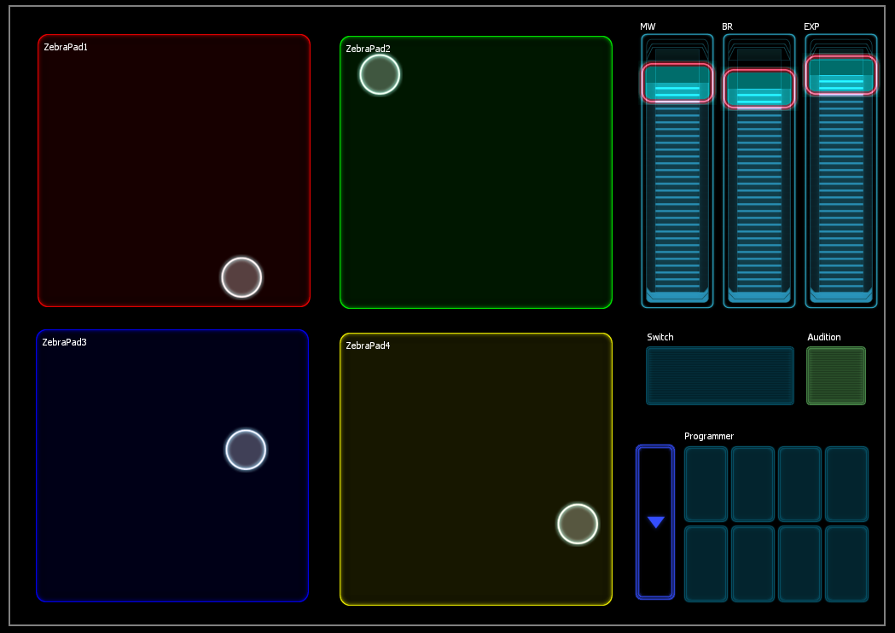
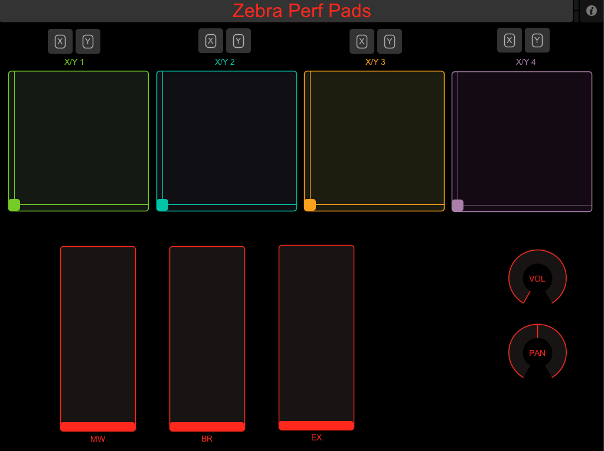

# README

[Zebra2](http://www.u-he.com/zebra/) + [Lemur](http://liine.net/en/products/lemur/) gbControl version 0.1 (gets the job done)

**License:** Please distribute. Please improve. Credit me if you fork and/or distribute. Above all, distribute and improve on this template ([CC-BY](http://creativecommons.org/licenses/by/3.0/)).

Instant gratification performance pad control for the Zebra2 synthesizer or any other mappable parameters for the MIDI-capable software/hardware of your choice. Lots of work left to do, this was a quick one to familiarize myself with the Lemur environment. iPad resolution only. Simple, straightforward.

**Bonus:** Similar controller layout for [TouchOSC](http://hexler.net/software/touchosc).

## Notes on Lemur Template:
* **Sliders**: Mod Wheel (cc1), Breath Controller (cc2), and Expression Pedal (cc11)
* **Switch:** Turns friction on and off for the physics-enabled pads
* **Audition:** Sends a C3 note (MIDI Note 60)
* **Programmer:** Easy MIDI learn! Each set of 2 pads (2 top, 2 bottom sets) send the X and Y CCs (respectively) for simple programming, or bumping to full if you like to play that way.
* The custom button to the left of the programmer pads isn't hooked up in v0.1.

Thanks, – gb

---

